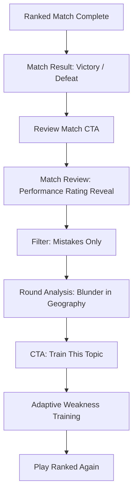

# IQ ARENA — Match Review & Telemetry Specification

> *"Chess.com post-game analysis × esports performance recap × shareable competitive identity."*

---

## 1. Overview

**IQ ARENA Match Review** transforms raw match telemetry into an actionable post-game story. After completing a Ranked match, players can inspect their decisions, see what peers in their rating division do, understand their unforced errors, and immediately train their identified weakness categories.

---

## 2. The 6 Round Classifications

Every completed competitive round is evaluated using strict, deterministic thresholds:

| Classification | Meaning | Visual Color | Primary Rule |
| :--- | :--- | :--- | :--- |
| **INSTANT** | Lightning response speed | Electric Cyan | $\text{Correct} \land \text{Response} \le \min(\text{Median} \times 0.45, 1.4\text{s})$ |
| **ELITE** | Mastered hard/expert question | Championship Gold | $\text{Correct} \land \text{Expected Probability} \le 0.35$ |
| **GOOD** | Solid controlled answer | Clean Emerald | $\text{Correct} \land \text{Standard time & peer expectation}$ |
| **HESITATION** | Correct but slow | Warm Amber | $\text{Correct} \land \text{Response} \ge \text{Median} \times 1.70 \land \text{Response} \ge 5.0\text{s}$ |
| **MISS** | Standard wrong answer | Muted Slate | $\text{Incorrect} \land \text{Expected Probability} < 0.75$ |
| **BLUNDER** | Unforced error on easy question | Strong Crimson | $\text{Incorrect} \land \text{Expected Probability} \ge 0.75$ |

---

## 3. Performance Rating Model (Non-Elo)

### Philosophy
- **Post-Game Metric Only**: Performance Rating never modifies Arena Rating (which is governed strictly by the Elo $K=24$ engine).
- **Statistical Shrinkage**: A match contains only 8 questions, which is too small for raw inversion. We apply a shrinkage factor of $0.65$ toward the player's baseline Arena Rating before the match.
- **Bounds**: Clamped to $[\text{ArenaRating} - 450, \text{ArenaRating} + 450]$.

### Formula
$$\text{PerformanceRating} = \text{Clamp}\left(\text{ArenaRating} + (\text{RawPerformance} - \text{ArenaRating}) \times 0.65, \pm 450\right)$$

---

## 4. The Golden Product Loop

---

## 5. Security & Privacy
1. **Server-Side Computation**: All classifications and performance ratings are computed on the server. Clients cannot self-declare labels.
2. **Participant Secrecy**: Match Reviews are accessible only to the match participants via RLS.
3. **Snapshot Immutability**: Historical match reviews are persisted with `analysis_version: 1` so future telemetry changes never alter past match records.
