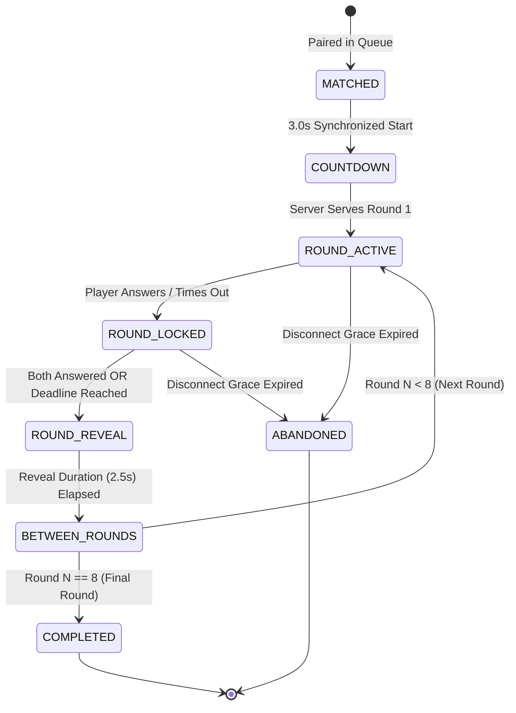

# IQ ARENA — Ranked Match State Machine Specification

## 1. State Machine Overview

The competitive Ranked match lifecycle is governed by an explicit server-authoritative state machine with zero contradictory boolean flags:

---

## 2. State Invariants & Payload Matrix

| State | Allowed Client Actions | Server Payload Contents | Hidden Server Data |
| :--- | :--- | :--- | :--- |
| **MATCHED** | None (Wait for countdown) | `matchId`, `playerA`, `playerB`, `startsAt` | Questions pool |
| **COUNTDOWN** | None (Animate 3..2..1..) | `startsAt`, `opponentPublicSummary` | Correct answers |
| **ROUND_ACTIVE** | `submitRoundAnswer` | Current Round Q (`prompt`, `options`), `expiresAt`, `opponentLocked` | `correct_option_id`, future rounds |
| **ROUND_LOCKED** | None (Waiting for opponent) | `selfAnswer.lockedAt`, `opponentLocked: true` | Opponent's choice, `correct_option_id` |
| **ROUND_REVEAL** | None (Reviewing reveal) | `reveal.correctOptionId`, both answers, speed comparison, round score | Future rounds |
| **BETWEEN_ROUNDS** | None (Syncing next round) | Incrementing round index | Next question prompt until active |
| **COMPLETED** | `requestRematch`, `exit` | Final scores, winner ID, rating shifts ($K=24$), updated world ranks | None |
| **ABANDONED** | `viewResult` | Forfeit outcome, adjusted ratings | None |

---

## 3. Disconnect & Forfeit Rules

1. **Grace Period**: 15 seconds from last heartbeat / socket drop.
2. **Reconnection**: If player returns within 15 seconds, client calls `getMatchSnapshot` and resumes the active round countdown based on `expires_at - now()`.
3. **Forfeit Penalty**: If a player remains disconnected past the grace period, the match is marked `abandoned` and awarded as a forfeit victory to the connected player.
