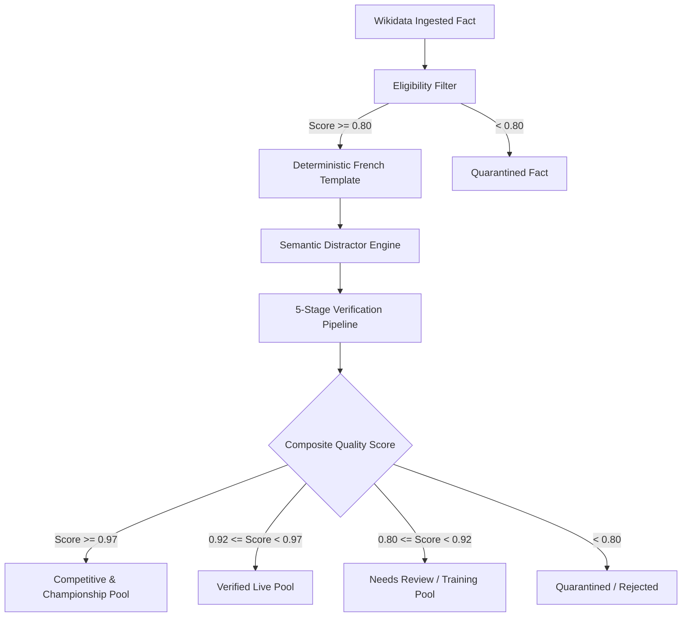

# IQ ARENA — Question Quality & Verification Standards

> *"Quality > Quantity. Provenance > Hallucination. Server Authority > Client Trust. 1,000 Excellent Questions > 1,000,000 Mediocre Questions."*

---

## 1. Quality Philosophy

IQ ARENA is a high-stakes competitive sport built around human knowledge. If a question is ambiguous, grammatically broken, inaccurate, or contains ridiculous distractors, the competitive integrity of the entire game is destroyed.

Every question in IQ ARENA must satisfy 5 absolute criteria before entering the competitive pool:
1. **Factual Impeccability**: 100% grounded in canonical Wikidata triples or primary reference sources with traceable entity/property lineage.
2. **Grammatical Naturalness**: Concise, native French phrasing without AI boilerplate or awkwardly nested clauses.
3. **Semantic Distractor Rigor**: Distractors must be plausible, semantically related peers (e.g. European capitals for European countries) and never absurd nonsense.
4. **Unambiguity**: Exactly one correct answer exists across all reasonable interpretations.
5. **Anti-Leak Integrity**: Correct options are stripped of ground-truth flags and metadata before client transmission.

---

## 2. Multi-Dimensional Validation Pipeline

---

## 3. The 5 Verification Dimensions

| Dimension | Weight | Description | Pass Criteria |
| :--- | :---: | :--- | :--- |
| **Factual Alignment** | 35% | Verification against canonical knowledge base | Exact match with verified triple object value |
| **Unambiguity & Phrasing** | 25% | Detection of double negatives, time traps, exam anti-patterns | No negative framing, no outdated temporal traps |
| **Distractor Quality** | 20% | Semantic plausibility, balance, no alias collision | 3 distinct valid peers from same domain/category |
| **Language & Grammar** | 10% | Native French grammar, punctuation, typographic quotes | Natural syntax, correct prepositions and accents |
| **Deduplication** | 10% | Detection of exact prompts or concept variant density | Unique prompt signature, max 3 variants per concept |

---

## 4. Trust Pools Hierarchy

Questions are automatically assigned to trust pools based on their composite quality score and administrative review status:

1. **`training`**: Suitable for unranked practice, warmups, and solo training bots.
2. **`verified`** *(1,160 questions)*: Passed automated validation (score >= 0.92), active in ranked matchmaking and daily challenges.
3. **`competitive`** *(1,160 questions)*: High-confidence variants (score >= 0.97) approved for high-Elo matches (Diamond, Master, Grandmaster, Legend).
4. **`championship`**: Hand-audited variants reserved for seasonal finals, tournaments, and official broadcast cups.

---

## 5. Distractor Tiering Guidelines

### Easy Tier
- Distractors are prominent entities within the same macro-category (e.g. asking for the capital of Spain: *Rome, Berlin, Lisbonne*).

### Medium Tier
- Distractors are entities from the same geographical region, subcategory, or historical era (e.g. asking for the author of *Madame Bovary*: *Émile Zola, Honoré de Balzac, Alexandre Dumas*).

### Hard / Expert Tier
- Distractors are near-neighbors, contemporaries, or closely competing entities (e.g. asking for atomic number 26: *fer, cobalt, nickel, manganèse*).

---

## 6. Audit Sample Statistics

The V1 Question Factory generated **1,160 auto-verified French questions** with the following distribution:

- **Geography**: 735 questions (Capitals, Continents, Currencies, Highest Points)
- **Science**: 202 questions (Chemical Symbols, Atomic Numbers, Discoveries)
- **Art**: 45 questions (Famous Paintings, Sculptures)
- **Literature**: 61 questions (Masterpiece Novels, Authors, Nationalities)
- **Cinema**: 30 questions (Iconic Films, Directors)
- **History**: 26 questions (Major Dates, Dynasties)
- **Classical Music**: 18 questions (Compositions, Operas, Ballets)
- **Nature**: 15 questions (Taxonomic Classes, Zoology)
- **Technology**: 14 questions (Inventions, Creators)
- **Food & Culture**: 14 questions (Specialties, Country of Origin)

**Difficulty Distribution**:
- Easy: 447 (38.5%)
- Medium: 470 (40.5%)
- Hard: 243 (21.0%)
